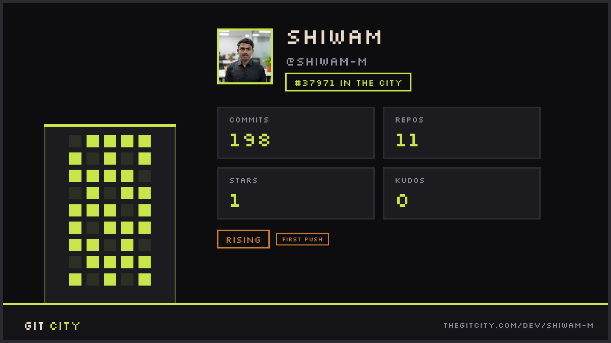

  

<!-- 

  

 -->

## About Me       
I am deeply immersed in the world of Computer Science and have a profound interest in AI, Machine Learning, Generative AI, and Agentic Systems. I thoroughly enjoy formulating strategies, envisioning the future, and working with cutting-edge technologies. Furthermore, I truly enjoy interacting with people, connecting with them, and understanding their ideas and perspectives.

## Languages and Tools

**Machine Learning, Deep Learning & Foundations**
<table style="border-spacing:10px;">
<tr>
<td align="center" style="padding:10px; background:#282c34; border-radius:15px; width:90px; height:90px;"> Python</td>
  <td align="center" style="padding:10px; background:#282c34; border-radius:15px; width:90px; height:90px;">
     
    Scikit-Learn
  </td>
  <td align="center" style="padding:10px; background:#282c34; border-radius:15px; width:90px; height:90px;"> PyTorch</td>
<td align="center" style="padding:10px; background:#282c34; border-radius:15px; width:90px; height:90px;"> TensorFlow</td>
<td align="center" style="padding:10px; background:#282c34; border-radius:15px; width:90px; height:90px;"> NumPy</td>
<td align="center" style="padding:10px; background:#282c34; border-radius:15px; width:90px; height:90px;"> Pandas</td>
</tr>
</table>

**Generative AI & LLM Orchestration**
<table style="border-spacing:10px;">
<tr>
  <td align="center" style="padding:10px; background:#282c34; border-radius:15px; width:90px; height:90px;">
     
    LangChain
  </td>
  <td align="center" style="padding:10px; background:#282c34; border-radius:15px; width:90px; height:90px;">
     
    <strong>LangGraph</strong> 
    Multi-Agents
  </td>
  <td align="center" style="padding:10px; background:#282c34; border-radius:15px; width:90px; height:90px;">
     
    <strong>RAG</strong> 
    Pipelines
  </td>
  <td align="center" style="padding:10px; background:#282c34; border-radius:15px; width:90px; height:90px;">
     
    HuggingFace
  </td>
  <td align="center" style="padding:10px; background:#282c34; border-radius:15px; width:90px; height:90px;">
     
    LLMs
  </td>
</tr>
</table>

**Vector Databases & Backend**
<table style="border-spacing:10px;">
<tr>
  <!-- FAISS (Meta Logo - Best for reliability) -->
  <td align="center" style="padding:10px; background:#282c34; border-radius:15px; width:90px; height:90px;">
     
    FAISS
  </td>
  <!-- ChromaDB -->
  <td align="center" style="padding:10px; background:#282c34; border-radius:15px; width:90px; height:90px;">
     
    ChromaDB
  </td>
  <!-- FastAPI -->
  <td align="center" style="padding:10px; background:#282c34; border-radius:15px; width:90px; height:90px;">
     
    FastAPI
  </td>
  <!-- Pydantic (Official SVG) -->
  <td align="center" style="padding:10px; background:#282c34; border-radius:15px; width:90px; height:90px;">
     
    Pydantic
  </td>
  <!-- Flask (White/Light Filter) -->
  <td align="center" style="padding:10px; background:#282c34; border-radius:15px; width:90px; height:90px;">
     
    Flask
  </td>
  <!-- PostgreSQL -->
  <td align="center" style="padding:10px; background:#282c34; border-radius:15px; width:90px; height:90px;">
     
    PostgreSQL
  </td>
</tr>
</table>

**Deployment & Frontend**
<table style="border-spacing:10px;">
<tr>
  <!-- Docker -->
  <td align="center" style="padding:10px; background:#282c34; border-radius:15px; width:90px; height:90px;">
     
    Docker
  </td>
  <!-- CI/CD (GitHub Actions) -->
  <td align="center" style="padding:10px; background:#282c34; border-radius:15px; width:90px; height:90px;">
     
    CI/CD
  </td>
  <!-- Streamlit -->
  <td align="center" style="padding:10px; background:#282c34; border-radius:15px; width:90px; height:90px;">
     
    Streamlit
  </td>
  <!-- React -->
  <td align="center" style="padding:10px; background:#282c34; border-radius:15px; width:90px; height:90px;">
     
    React
  </td>
</tr>
</table>

---

  

---

  

---

  

---

  

  

 

### Connect with Me 

  
  
  

